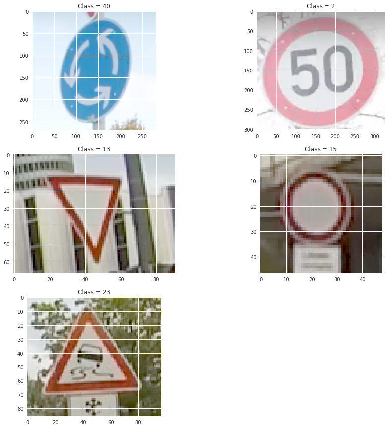

## Project: Build a Traffic Sign Recognition Program
[](http://www.udacity.com/drive)

Overview
---

After learning about deep learning, this project, like the project name, emphasizes on building a classifier that will help identify traffic signals on the road.

The key for this in my opinion would lie in the way the data is preprocessed.  With a great model, it is possible to achieve a very high accuracy even above 90%.  However, to leverage that to 95% and above, preprocessing the data will play a huge role.  This project uses the ideas present in this [paper](http://yann.lecun.com/exdb/publis/pdf/sermanet-ijcnn-11.pdf) to build an accurate traffic sign classifier.


Table of Contents
---

1. [Getting Started](#getting-started)
2. [Loading Data](#loading-data)
3. [Data Preprocessing](#data-preprocessing)
4. [Deep Learning Architecture](#deep-learning-architecture)
5. [Model Testing](#model-testing)
6. [Discussion](#discussion)
7. [Conclusion](#conclusion)


Getting Started
---

This lab requires:

* [CarND Term1 Starter Kit](https://github.com/udacity/CarND-Term1-Starter-Kit)

The training and testing data has already been provided by Udacity for training the model.

Loading Data
---

```python
import pickle

training_file = '../data/train.p'
validation_file= '../data/valid.p'
testing_file = '../data/test.p'

with open(training_file, mode='rb') as f:
    train = pickle.load(f)
with open(validation_file, mode='rb') as f:
    valid = pickle.load(f)
with open(testing_file, mode='rb') as f:
    test = pickle.load(f)
    
X_train, y_train = train['features'], train['labels']
X_valid, y_valid = valid['features'], valid['labels']
X_test, y_test = test['features'], test['labels']
```

Here is a quick summary and visualization of the datasets.

```
Number of training examples = 34799
Number of testing examples = 12630
Image data shape = (32, 32, 3)
Number of classes = 43
```

  


Data Preprocessing
---

To start off, I've played around with a few other preprocessing techniques but have had most success when following the [paper](http://yann.lecun.com/exdb/publis/pdf/sermanet-ijcnn-11.pdf).  Similar to the paper, I converted all the images into a **YUV color space** and returned only the normalized **Y Channel**.  I have used the package `skimage.exposure.equalize_adapthist()` for normalization as it is used for local contract enhancement and I have found that it makes edges more prominent in an image as seen below.


Then to model even more robust, I have augmented the data for training the model.  As seen in the visualization, the training dataset is skewed and this can lead to bias in a model.  So I have augmented the data in order to have the same or similar amount of data for all classes and on top of that I've also added random *rotations*, *translations* and *scalings* to each additional image in order to make the model even more robust.

```python
def augment_data(img_list,labels,low_thresh = 1300):
    
    new_imgs = []
    new_labels = []
    for feature in np.unique(labels):

        index = np.array(np.where(y_train == feature)).reshape(-1)
        tally = np.array(X_train[index]).reshape(-1,32,32,1)
        
        if len(index)<low_thresh:
            
            for indices in index:
            
                new_imgs.append(img_list[indices])
                new_labels.append(labels[indices])
        
            for i in range(1300-len(index)):
                
                ind = random.choice(index)
                
                img = img_list[ind]
                img = translation(img)
                img = scale(img)
                img = rotate(img)
                    
                    
                new_imgs.append(img)
                new_labels.append(labels[ind])
                
        else:
            for indices in index:
                
                new_imgs.append(img_list[indices])
                new_labels.append(labels[indices])
                
    
    return np.array(new_imgs).reshape(-1,32,32,1), np.array(new_labels)
```

  

Deep Learning Architecture
---

After reading the paper, I have chosen to use a *Multi Scale* model (in this case, a 2 stage CovNet architecture) where the 1st and 2nd stage features are fed to the classifier shown in the image below.


I have chosen to use the same model as show in the table below.  This model will have 108 features for the 1st and 2nd stage but with a slight tweak in the classifier layer where instead of using a 100 features, I've chosen to use 108 features to try it out.


I've decided to use `EPOCHS = 60` and `Batch size = 100` because after a lot of trial and errors, I've found that the model tends plateau with only 20 Epochs but increased it to 60 for the sake of seeing if increasing the number of epochs will increase the accuracy of the training model.  A batch size of 100 seems to be a good point because lowering or increasing this number I've found the model to perform slighly worse if not bad.

Other setups for the model include using a **softmax cross entropy loss** and an **Adam Optimizer** with a low learning rate `rate = 0.0001`. This was used as this made the model perform better and was able to see a higher accuracy on the training and validation set.

```
EPOCH 58 ...
Validation Accuracy = 0.992

EPOCH 59 ...
Validation Accuracy = 0.992

EPOCH 60 ...
Validation Accuracy = 0.993

Model saved
```

Model Testing
---

After training and saving the model, it is time to test the model on the `test` dataset which the model has not seen at all.  The result looks amazing where I am able to get a **Test** accuracy of 97.5% from the model created.  

```
INFO:tensorflow:Restoring parameters from ./lenet
Test Accuracy = 0.975
```

Furthermore, Udacity encouraged to us to find traffic signs randomly from the website.  I took a screenshot of some pictures from a random road video as well as from google images totalling 5 new images.  The image were selected because it was identical to the test set.  These images are shown below and are fed into the model in order to see if they will be classified correctly.

  

```
INFO:tensorflow:Restoring parameters from ./lenet
Test Set Accuracy = 1.000
```
The model was able to correctly identify the classes of all new images!  This is amazing however, this is only for 5 images, it would be more reassuring if it was tested on 100 new images found randomly on the website or my own.  Additionally, these images are quite clear, there will definitely be misclassified images if there were lighting problems or a sign that is damaged or not clear (see [Discussion](#discussion) for more detail.

On top of that, the top 5 softmax probabilities for each image is shown below to give an idea of how the model performed.

```
INFO:tensorflow:Restoring parameters from ./lenet
TopKV2(values=array([[  9.99981523e-01,   1.83955144e-05,   3.60982497e-08],
       [  9.96065199e-01,   3.91497836e-03,   1.00642283e-05],
       [  9.96908605e-01,   1.84577657e-03,   5.92457654e-04],
       [  9.96045172e-01,   2.69794650e-03,   8.87676841e-04],
       [  9.99998450e-01,   1.14552097e-06,   3.56418610e-07]], dtype=float32), indices=array([[40, 12,  5],
       [ 2,  1, 14],
       [13, 24, 29],
       [15, 12,  1],
       [23,  2, 19]], dtype=int32))
```

We can see that the probabilities exceed 0.96 for each image classification which shows that the model is able to make great predictions, but there is still a lot of room for improvement.

Discussion
---

It was a fun project where I pushed myself to achieve an accuracy of over 98% for the training set and achieve a very high accuracy on the test data set.  I tried many different models found on the paper as well as all their preprocessing techniques until I was able to achieve similar results.

It would be interesting to test many different models that are available right now to see if the accuracy of the model on the testing data set would be able to reach 99% which would be better than human accuracy.

However, as mentioned before for traffic signs, if there is any pertubation or damage to the traffic sign, the images could be misclassified.  I added two more images, both stop signs with some perturbation.


```
INFO:tensorflow:Restoring parameters from ./lenet
Test Set Accuracy = 0.714
```

And the top 5 probabilitiess shows that the new added signs were classified wrong (this piece of code can be found in `Images.ipynb`).

```
INFO:tensorflow:Restoring parameters from ./lenet
TopKV2(values=array([[  9.99981523e-01,   1.83954107e-05,   3.60981822e-08],
       [  9.96065199e-01,   3.91497463e-03,   1.00641610e-05],
       [  9.96908605e-01,   1.84577308e-03,   5.92454569e-04],
       [  9.96045172e-01,   2.69794138e-03,   8.87671718e-04],
       [  9.99998450e-01,   1.14552768e-06,   3.56419974e-07],
       [  9.78011131e-01,   2.02589706e-02,   1.49508868e-03],
       [  9.84147668e-01,   1.31006921e-02,   2.64910562e-03]], dtype=float32), indices=array([[40, 12,  5],
       [ 2,  1, 14],
       [13, 24, 29],
       [15, 12,  1],
       [23,  2, 19],
       [12, 13,  9],
       [ 1,  4, 12]], dtype=int32))
```

Conclusion
---

In conclusion, the toughest part for me would be the preprocessing part.  It is really challenging to provide the best inputs for the model to train on.  There are many things to consider and tradeoffs are always there but finding the best combinations become very rerwarding once achieved.  My model was able to achieve decent if not great results but with the only drawback of misclassifying perturbed signs.


